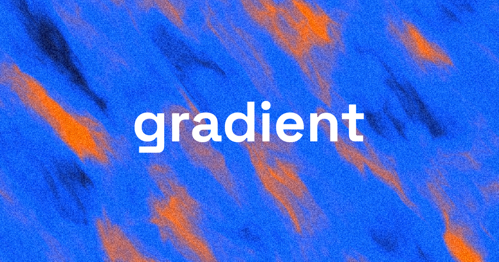

<p align="center">
  
</p>

<h1 align="center">gradient</h1>

<p align="center"><strong>Animated gradients for web UIs</strong></p>

<p align="center">
  <a href="https://www.npmjs.com/package/gradient-runtime"></a>
  <a href="LICENSE"></a>
</p>

<p align="center">
  <a href="https://gradient.oyaboon.com">Website</a> ·
  <a href="https://gradient.oyaboon.com/docs">Docs</a> ·
  <a href="https://www.npmjs.com/package/gradient-runtime">npm</a> ·
  <a href="https://github.com/oyaboon/gradient">GitHub</a> ·
  <a href="https://x.com/oyaboonx">X</a>
</p>

---

**gradient** is a generator and runtime for animated, grainy WebGL gradients: design in the browser, export to PNG, ZIP, or embed code, and ship the same look in your app with **[gradient-runtime](https://www.npmjs.com/package/gradient-runtime)** (MIT).

## Features

- **Generator** — palette, motion, warp, grain, quality controls; preset gallery
- **Export** — PNG, ZIP (e.g. Wallpaper Engine), embed snippets
- **Self-hosted runtime** — ESM, IIFE global, and React (`GradientMount`) builds
- **Site** — [gradient.oyaboon.com](https://gradient.oyaboon.com) with docs and licensing

## Quick start (runtime)

```bash
npm install gradient-runtime
```

**React:**

```tsx
import { GradientMount } from "gradient-runtime/react";
import type { GradientPreset } from "gradient-runtime/react";

const preset: GradientPreset = {
  presetVersion: 1,
  engineId: "grain-v1",
  params: {
    uniform_seed: 42,
    uniform_palette_colors_hex: ["#0a0a12", "#1a1a2e", "#2563eb", "#f97316"],
    uniform_motion_speed: 0.6,
    uniform_flow_rotation_radians: 0.9,
    uniform_flow_drift_speed_x: 0,
    uniform_flow_drift_speed_y: 0,
    uniform_warp_strength: 0.5,
    uniform_warp_scale: 2.2,
    uniform_turbulence: 0.4,
    uniform_brightness: 1.05,
    uniform_contrast: 1.12,
    uniform_saturation: 1.2,
    uniform_grain_amount: 0.12,
    uniform_grain_size: 1.3,
    uniform_reduce_motion_enabled: 0,
  },
};

<GradientMount preset={preset} options={{ mode: "hover" }} className="rounded-lg">
  <span className="relative z-10 px-4 py-2">Your content</span>
</GradientMount>
```

More examples: [package README](packages/gradient-runtime/README.md) and [docs](https://gradient.oyaboon.com/docs).

## Repository layout

| Path | Purpose |
|------|---------|
| `src/` | Next.js app (generator, API, Paddle checkout) |
| `src/engine/` | Shared gradient engine |
| `packages/gradient-runtime/` | Published npm package (`gradient-runtime`) |
| `scripts/build-runtime.mjs` | esbuild pipeline for runtime bundles |

## Tech stack

Next.js, React, WebGL shaders, Tailwind, Zustand, Prisma, esbuild.

## License

The **`gradient-runtime`** package is [MIT](LICENSE). The monorepo may include app-specific code governed by the same LICENSE file unless noted otherwise; see [LICENSE](LICENSE).

---

<p align="center">
  <a href="https://github.com/oyaboon/gradient">GitHub</a> ·
  <a href="https://x.com/oyaboonx">@oyaboonx</a>
</p>
